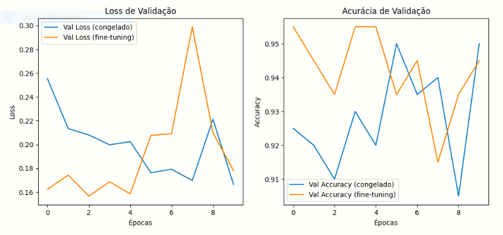
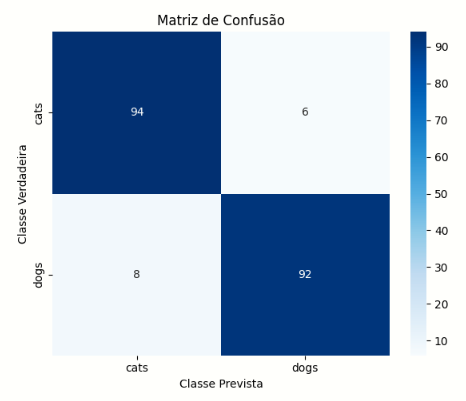
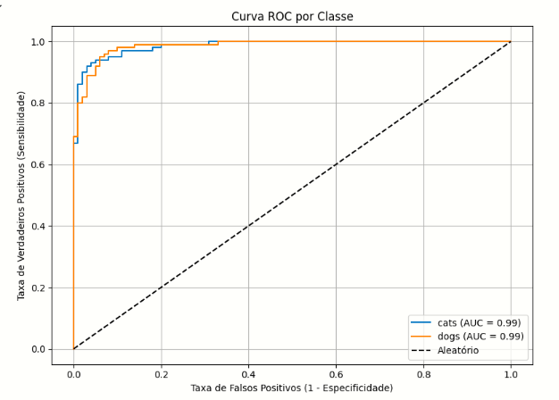

## 🐾 MatrizDeConfusao do Classificador de Gatos vs Cachorros (com VGG16 e Fine‑Tuning)

Este projeto faz parte do aprendizado e metodo de avaliação do Bootcamp promovido pela DIO + e empresa
BairesDev.

1. 🧾 Visão geral

Este projeto treina um modelo de CNN usando Transfer Learning sobre a arquitetura VGG16, com fine‑tuning das últimas camadas, para classificar imagens como gatos ou cachorros. Inclui avaliação por matriz de confusão, curva ROC e métricas detalhadas (acurácia, precisão, sensibilidade, especificidade, F1‑score). Neste projeto foi adicionado ao dataset 1000 imagens de gatos e cachorros diferente da primeira versão em que testei apenas com 100 imagens e não tinha adicionado o cálculo da matriz de confusão.

2. ⚙️ Requisitos

Python 3.8+
Google Colab ou ambiente com GPU
Bibliotecas necessárias:
TensorFlow ≥ 2.x
numpy, matplotlib, seaborn
scikit-learn
pandas (opcional)

Instalação rápida:
pip install tensorflow numpy matplotlib seaborn scikit-learn pandas

3. 🚀 Uso passo a passo

Clone o repositório:
git clone https://github.com/HuinaGabriela/MatrizDeConfusaoDoProjetoClassificadorRapidoCNNcomVGG16.git

Entre na pasta do projeto e abra o Colab ou Jupyter Notebook:
cd seu_repositorio && jupyter notebook
ou
colab [notebook.ipynb](https://colab.research.google.com/drive/1-Ah0gGmJ2lUB7qcdyvtgkhgcoVY9Ylvi?authuser=0#scrollTo=8k6j3DqJ5TCu)

4. 📈 Resultados esperados

Validação: ~ 95% de acurácia
Treino/Fine‑tuning: até ~ 97‑98% de acurácia
Métricas: precisão, sensibilidade e F1‑score acima de ~ 0.90
Curva ROC com AUC alto para ambas as classes (gatos e cachorros)

O modelo tem boa performance fora do treino, mas nas últimas épocas do fine‑tuning,
o val_loss aumentou levemente, sinal de que pode estar memorizando.
Porém é normal quando se usa fine‑tuning com muitos dados.

## 📈 Evolução do Treinamento

Abaixo temos o gráfico de **loss** e **acurácia** ao longo das épocas:

## 📊 Matriz de Confusão

Visualização da matriz de confusão após avaliação no conjunto de teste:

# 🧠 Curva ROC (Receiver Operating Characteristic)

A curva ROC mostra a capacidade do modelo em distinguir entre as classes:

5. 🧠 Interpretação das métricas
Acurácia: percentual de imagens classificadas corretamente.
Precisão: das imagens que previu como "gato", quantas eram realmente gatos.
Sensibilidade (Recall): das imagens que eram de gatos, quantas foram identificadas.
Especificidade: das imagens que não eram gatos (cachorros), quantas o modelo reconheceu corretamente.
F1‑score: média harmônica entre precisão e sensibilidade.

📊 O que é a Matriz de Confusão?
A matriz de confusão é uma ferramenta usada para entender como o modelo está acertando e errando suas previsões. No caso de duas classes (gatos e cachorros), ela tem este formato:

 |                        | **Previsto: Gato**      | **Previsto: Cachorro** |
|------------------------|--------------------------|--------------------------|
| **Verdadeiro: Gato**   | VP (Verdadeiro Positivo) | FN (Falso Negativo)     |
| **Verdadeiro: Cachorro** | FP (Falso Positivo)     | VN (Verdadeiro Negativo)|

- **VP (True Positive)**: modelo disse "gato" e era "gato".
- **VN (True Negative)**: modelo disse "cachorro" e era "cachorro".
- **FP (False Positive)**: modelo disse "gato", mas era "cachorro".
- **FN (False Negative)**: modelo disse "cachorro", mas era "gato".

A partir desses valores, calculamos:

| **Métrica**     | **Fórmula**                                  | **Interpretação**                                                                 |
|------------------|----------------------------------------------|------------------------------------------------------------------------------------|
| Acurácia         | (VP + VN) / Total                            | Proporção total de acertos do modelo                                              |
| Precisão         | VP / (VP + FP)                               | Das vezes que o modelo disse “gato”, quantas vezes ele estava certo?             |
| Recall (Sens.)   | VP / (VP + FN)                               | Das imagens que realmente eram “gato”, quantas o modelo identificou corretamente? |
| Especificidade   | VN / (VN + FP)                               | Das imagens que eram “cachorro”, quantas o modelo classificou corretamente?       |
| F1‑Score         | 2 × (Precisão × Recall) / (Precisão + Recall) | Combinação entre precisão e recall — útil com classes desbalanceadas              |

